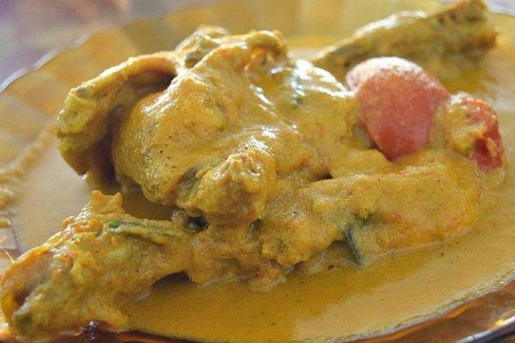
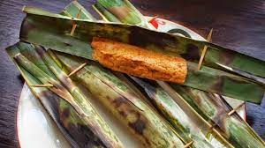

# <!--fit--> Makanan Awetan Dari Bahan Hewani

Tugas: Eriza Zehezkiel Gracia

---

## Cipera

---

### Informasi

* Cipera adalah makanan khas Suku Karo yang berasal dari Sumatera Utara yang dibuat dengan bahan dasar berupa daging ayam dan tepung jagung.

---

### Modifikasi Pada Makanan

* Modifikasi yang saya lakukan adalah menambah kentang dan jamur tiram kepada Cipera.

---

## Otak-Otak

---

### Informasi

* Otak-otak adalah makanan yang terbuat dari daging ikan tenggiri cincang yang dibungkus dengan daun pisang, dipanggang, dan disajikan dengan kuah asam pedas.

---

### Modifikasi

* Modifikasi yang saya berikan pada Otak-Otak adalah dengan mengganti kuah asam pedas dengan kuah sambal kacang.